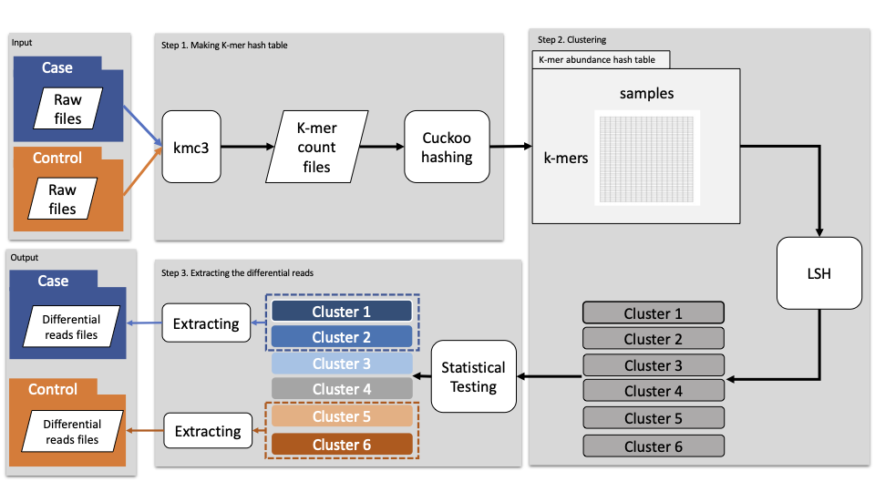

# kmerLSHSA

<p align="center">
  
</p>

kmerLSHSA is the latest subtractive assembly approach for extracting differential reads from differential genes/genomes. If your metagenome sequencing data has two groups (healthy vs disease) and your goal is to find the differential abundant genes/genomes related with the phenotypes, kmerLSHSA is good option to analyze. kmerLSHSA can extract the only differential reads based on the k-mers' abundance profiling information. You don't need to use whole raw files for binning or gene prediction. 

Furthermore, we provide already trained model with 4 disease datasets(livercirrhosis, T2D, RCC, NSCLC). 

## Prerequisites

* g++ with version 5.1.0+ is required.
* KMC3 : https://github.com/refresh-bio/KMC


## Installation
```
1. git clone https://github.com/mgtools/kmerLSHSA.git
2. move the kmerLSHSA directory
3. make
```

If you want to re-install kmerLSHSA, then
```
1. move the kmerLSHSA directory
2. make clean
3. make 
```


## Usage
```
./kmerLSHSA -a input1 -b input2 -o output1_prefix -p output2_prefix -k 23 [options]
```

  * -a, --input1=STRING (required)
  > Input filename for metagenome group A

  * -b, --input2=STRING (required)  
  > Input filename for metagenome group B

  * -o, --output1=STRING (required)
  > Prefix for output of metagenome A

  * -p, --output2=STRING (required)
  > Prefix for output of metagenome B

  * -K, --kmer_size=INT (required)
  > Size of k-mers, at most 31

  * -I, --cluster_iteration=INT
  > number of iteration for LSH <default 100>

  * -N, --min_similarity=FLOAT
  > minimum threshold of similarity <default 0.85>

  * -X, --min_similarity=FLOAT
  > maximum threshold of similarity <default 0.95>
    
  * -T, --threads_to_use=INT
  > Number of threads for running KMC etc. <default 8>
   
  * -R, --max-memory=INT 
  > Max memory for running KMC <default 12>
  
  * -C, --count-min=INT
  > Min threshold of k-mer count for running KMC <default 2>
  
  * -S, --size_thresh=INT
  > Threshold of the size of clustering for T-Test <default 500000>
  
  * -V, --kmer_vote=FLOAT
  > Percentage threshold of differential k-mers in distinctive reads <default 0.5>
  
  * -F, --clust_file_name=STRING
  > intermediate clustering result file name <default 'clustering_result.txt'>
  
  * -M, --mode=STRING
  > Start from this step. K : run kmc, B : make bin file, C : clustering, E : extract differential reads 
  
  * --verbose
  > Print messages during run
  
  * --only 
  > Run only the step mode. 

## Input files
The input files require the location of sequence files(.fq) and their names (or ID). The input files are tab-delimited. 
```
seq1_loc\tgroup1_seq1
seq2_loc\tgroup1_seq2
...
```
    
## Output files
Output files are sequence files(.fq) consist of differential reads. With these output files, you can do analysis such as binning, gene prediction or genome estimation.


<!--
## Examples
### Download simulated datasets
```

```
### Run kmerLSHSA

```
./kmerLSHSA -a -b -o -p 
```


## Machine learning scripts
We analyzed the 4 different disease data sets and built classifier models. We provide these models for re-using.   
### Download the predicted genes
```

```
### Use trained model for classification
Mi2Pr()


## Citation

-->

## Questions
Please contact Wontack Han(wthanone@gmail.com) for assistance.


## Acknowledgement
This work was supported by NIH grant 1R01AI143254 and NSF grant 2025451.


## License of kmerLSHSA

* KMC 3 is a free software distributed under GNU GPL3 licence for academic, research, and commercial use.
  http://sun.aei.polsl.pl/kmc

* The statistical testing is from the free edition of ALGIB, which is delivered for free under GPL 2+ terms. 
  http://www.alglib.net/download.php

* The hash functions used are from the MurmurHash Library, version 3, released under the MIT License. 
  http://code.google.com/p/smhasher/

* The concurrent hash table is copyrighted by Carnegie Mellon University and Intel Corporation and 
  released under the Apache License, version 2.0. http://github.com/efficient/libcuckoo

*   This program is free software: you can redistribute it and/or modify
    it under the terms of the GNU General Public License as published by
    the Free Software Foundation, either version 3 of the License, or
    (at your option) any later version.

    This program is distributed in the hope that it will be useful,
    but WITHOUT ANY WARRANTY; without even the implied warranty of
    MERCHANTABILITY or FITNESS FOR A PARTICULAR PURPOSE.  See the
    GNU General Public License for more details.

    You should have received a copy of the GNU General Public License
    along with this program.  If not, see <http://www.gnu.org/licenses/>.
